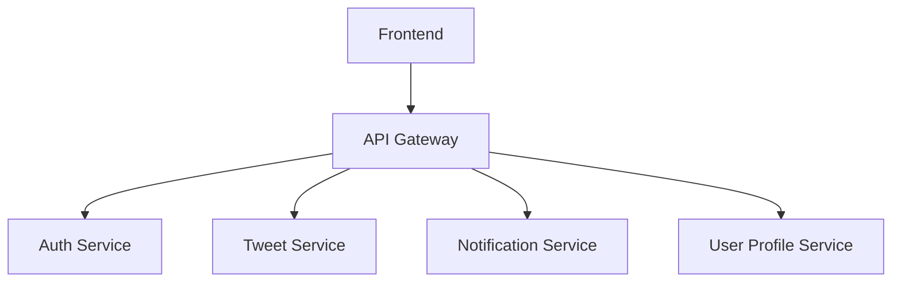

# Champions Arena

Willkommen zum **Champions Arena** Source Code! Champions Arena ist ein verteiltes Social-Media-System für Fussballfans weltweit.  
Dieses Repository enthält die Kernservices, das API-Gateway sowie das Frontend, um die Plattform aufzubauen, zu erweitern und individuell anzupassen.  

Dieses Projekt wird im Rahmen des Moduls **M321 – Projektarbeit LB2** als **Schulprojekt** entwickelt. Ziel ist es, ein modernes verteiltes System mit Microservice-Architektur zu planen, die Zuständigkeiten im Team klar zu definieren und die Anforderungen prototypisch umzusetzen. 

## Beschreibung des Systems

Champions Arena ist eine Social-Media-Plattform für Fussballfans. Das System ermöglicht es Nutzer:innen, sich zu registrieren, eigene Beiträge zu verfassen („Tweets“), andere Fans zu verfolgen und mit Inhalten zu interagieren.  

### Aufgaben des Systems
- Sichere Benutzerverwaltung mit Authentifizierung & Autorisierung  
- Erstellen, Lesen und Interagieren mit Beiträgen  
- Anzeigen und Verwalten von Benutzerprofilen  
- Echtzeit-Benachrichtigungen bei neuen Interaktionen  
- Einheitlicher Zugriff über ein API-Gateway  
- Bereitstellung einer modernen Weboberfläche  

### Anforderungen
- Skalierbarkeit durch Microservice-Architektur  
- Sicherheit durch zentrale Authentifizierung  
- Benutzerfreundlichkeit für weltweite Fans  
- Erweiterbarkeit durch modulare Architektur  

## Systemkomponenten und Zuständigkeiten

Das Projekt ist in folgende Teile aufgeteilt:  
1.  Der Auth Service ist für die Registrierung und den Login von Benutzer:innen zuständig. Er verwaltet Sitzungen und Sicherheitstokens, implementiert die Autorisierungslogik für geschützte Bereiche der Plattform und stellt sicher, dass nur authentifizierte Nutzer Zugriff auf die einzelnen Services haben.
2.  Der Tweet Service bildet die Kernfunktion für Beiträge („Tweets“). Er ermöglicht das Erstellen, Lesen, Bearbeiten und Löschen von Posts und unterstützt zusätzlich Interaktionen wie Likes und Kommentare. Darüber hinaus kümmert er sich um die Verwaltung des Feeds der Nutzer:innen.
3.  Der Notification Service sorgt für Echtzeit-Benachrichtigungen über wichtige Ereignisse, zum Beispiel wenn ein Nutzer einen neuen Follower erhält, ein Like oder einen Kommentar bekommt oder in einem Beitrag erwähnt wird. Dieser Service kann sowohl als Push-System als auch via Polling integriert werden und entlastet die übrigen Services, indem er eventbasiert arbeitet.
4.  Der User Profile Service verwaltet die persönlichen Profildaten wie Name, Bio und Profilbild. Er speichert ausserdem Informationen zu Followern und Following-Beziehungen und stellt Profilstatistiken wie die Anzahl von Beiträgen oder Likes bereit. Dadurch bildet er die Grundlage für eine personalisierte Nutzererfahrung.
5.  Das API Gateway fungiert als zentraler Einstiegspunkt für alle Anfragen vom Frontend. Es leitet die Anfragen an die zuständigen Services weiter und kann zusätzliche Funktionen wie Authentifizierung, Logging, Rate-Limiting oder Caching bereitstellen. Damit erhöht es die Sicherheit und reduziert die Komplexität im Frontend erheblich.
6.  Das Frontend schliesslich ist die Benutzeroberfläche, über die die Nutzer:innen mit der Plattform interagieren. Es wird mit moderner Web-Technologie (z. B. React, Vue oder Angular) umgesetzt und kommuniziert ausschliesslich mit dem API Gateway. Das Frontend bietet die wesentlichen Funktionen wie die Anzeige des Feeds, die Verwaltung von Profilen, das Erstellen von Beiträgen, die Anzeige von Benachrichtigungen sowie die Anmeldung und Authentifizierung.
